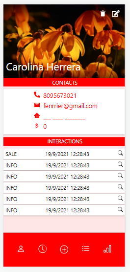
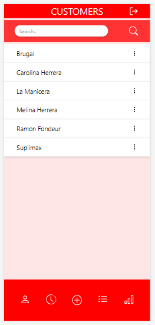
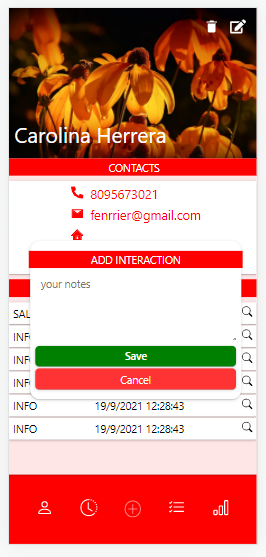
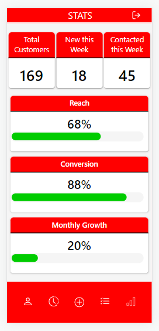
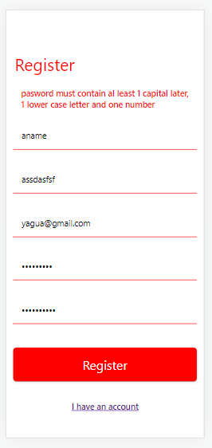
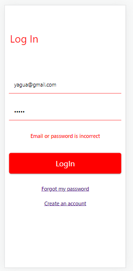
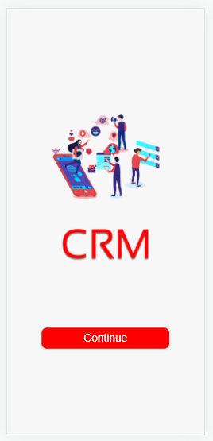
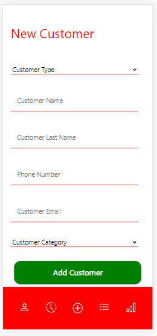

# CRM App

The application works as a personal customer relationship managent system that provides core functionalities that help small businesses keep track of their customer reach rate.
see more info about functionality in /backend/docs

## start the app

    1- create a .env fallowing the envexample file structure
    2- run "npm install" on both /client and /backend folders to install dependencies
    3- run "docker-compose up" in the backend folder to start the development database and then run npm run dev
    4- run "npm start" in the client folder to start the front end

keep in mind you need typescript installed

## To be developed:

### frontend

    [] Responsiveness for desktop view
    [] PWA Functionality
    [] Resset Password Functionality
    [] Hability to submit contact person for business customers
    [] Appointments page
    [] Emails page
    [] Own and owed stats
    [] Sales stats
    [] update customers profile

### Backend

    [] Appointments Module
    [] Mailing module
