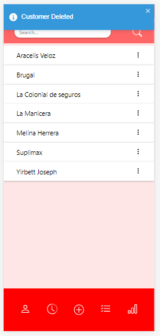

# CRM App

The application works as a personal customer managent system that provides core functionalityes that help small businesses to keep track of their own.
see more info about functionality in /backend/docs

## start the app

    1- create a .env fallowing the example file
    2- run npm install to install dependencies
    3- run docker-compose up in the backend folder to start the development database and then run npm run dev
    4- run npm start in the client folder

keep in mind you need typescript installed

